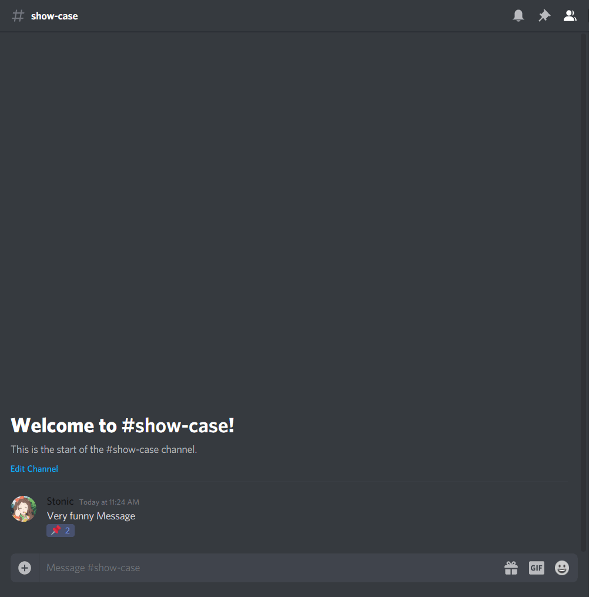
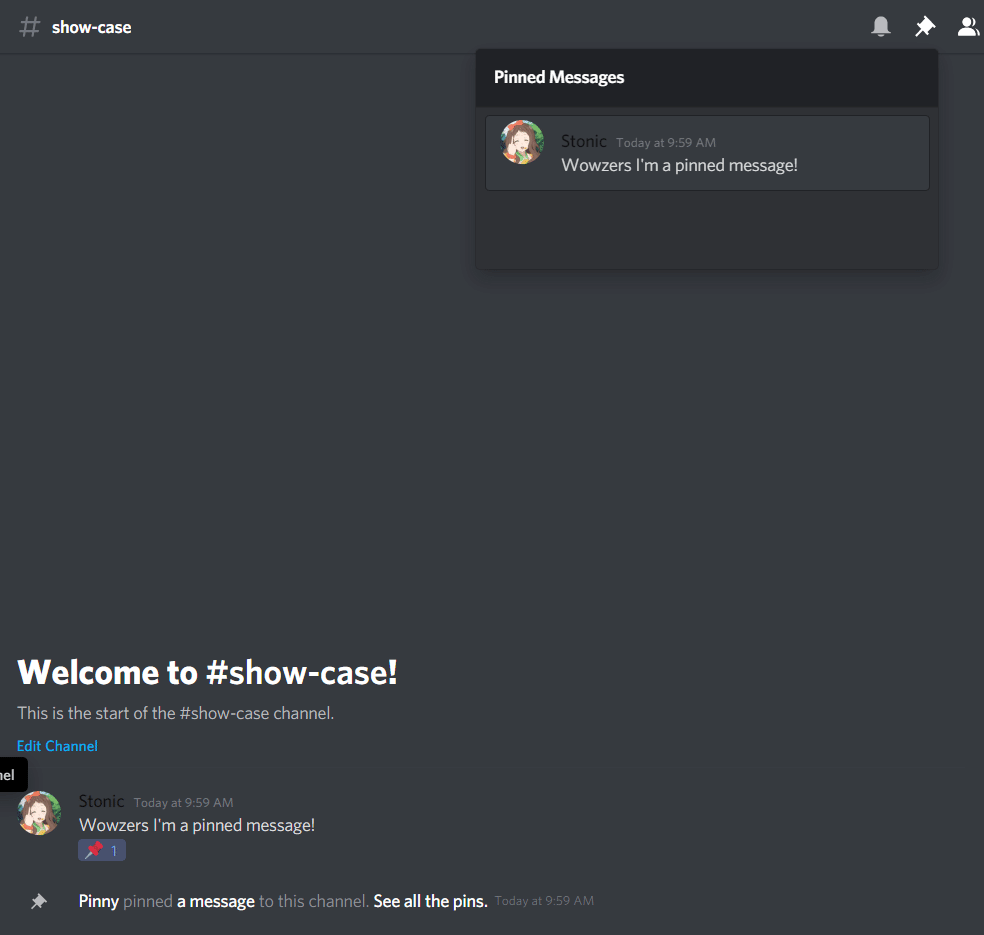

# Pinny

Pinny, counts as a utility bot that can pin messages! Basically...

## What can it do?

Well as stated before it can pin messages, but only when the message gets enough PinMojis, example on usage is shown below...

When the threshold arrives Pinny will pin the message! But when ever the message doesn't meet the threshold, it'll get unpinned, as shown below:

You can force add & remove pins with the following commands:

* `p!force create MESSAGE_ID`

* `p!force remove MESSAGE_ID`

Members with **[Pinner Role]**, are able to use the `force` command, even if their not VIP, Admin, or Owner ***(The special people)***. To set the pinner role use the following command:

* `p!settings pr ROLE_ID`

Pinny also comes with few other settings like, Pin Log (Logs whenever a pin message gets created, or removed), Pin Emote (The emote to track if the message should get pinned or not),  and the Pin Threshold (How many pins should it take for the message to get pinned). These all can be set like so:

* `p!settings pinemote 📌`

* `p!settings thresh 10`

* `p!settings log CHANNEL_ID`
